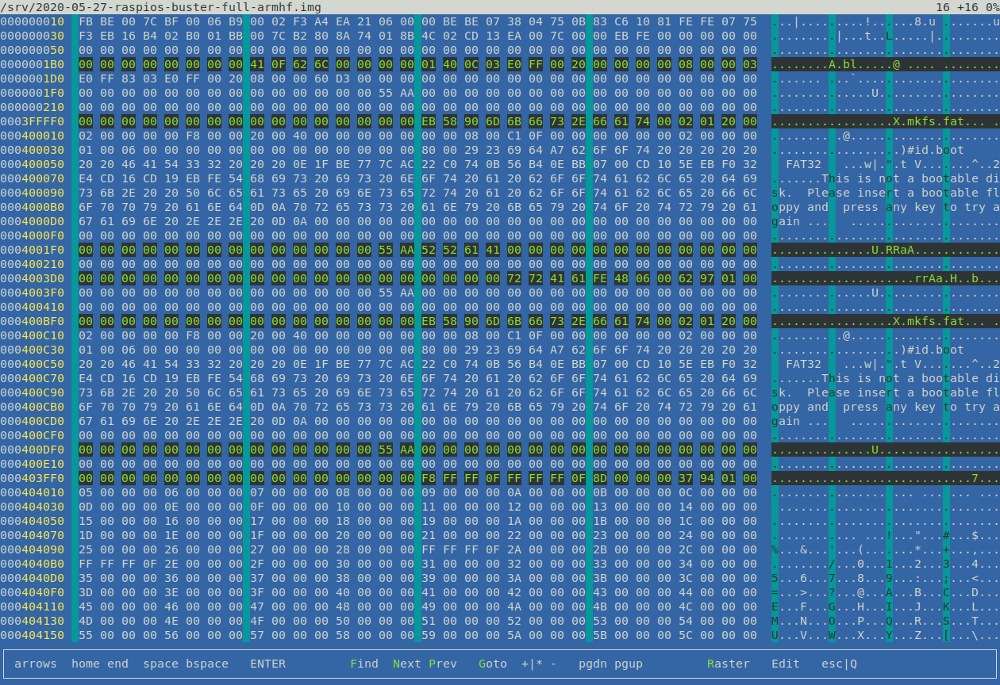
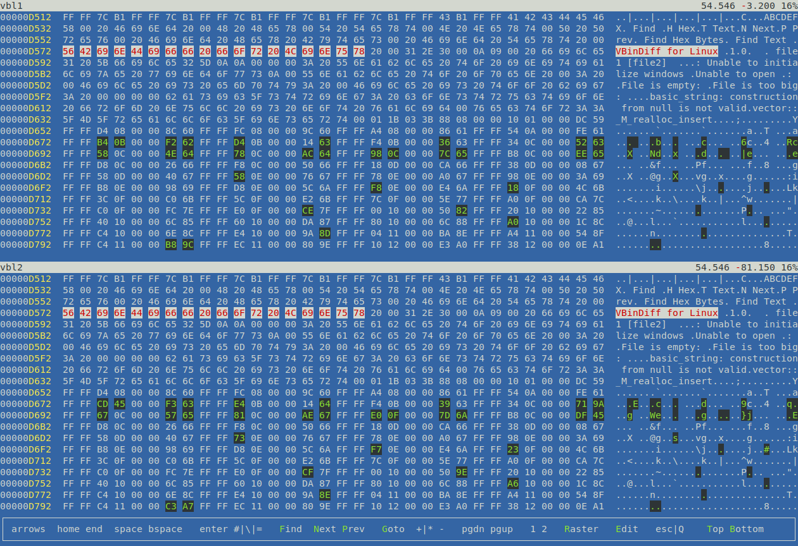

vbl - VBindiff for Linux
========================

Hex viewer and differ

For you Linuxer!

*32 byte hex & ascii view in a 140 columns terminal*

64-bit

based on "*VBinDiff - Visual Binary Diff*" by Christopher J. Madsen

Features:
---------

 - Ascii search __f__
 - Binary search
 - Forward search __n__
 - Backward search __p__
 - Search history
 - Search highlight
 - Search indentation
 - Marked hotkeys
 - Visual feedback
 - 64GB file handling
 - Goto position decimal __g__
 - Goto position percent
 - Goto position hex (abcd 0x1234 1234x)
 - Next difference __Enter__ (two files)
 - Prev difference __# \\ =__ (two files)
 - Next different byte __PgDn__
 - Prev different byte __PgUp__
 - Sync 1. with 2. view __1__ (two files)
 - Sync 2. with 1. view __2__ (two files)
 - File position decimal
 - File position percent
 - File offset difference
 - _Smartscroll_ (single mode) __ENTER__
 - Skip forward 5% __+ *__
 - Skip backward 1% __-__
 - Column raster __r__
 - Edit file (overwrite) __e__
 - Use only top file __t__
 - Use only bottom file __b__

Build:
------

```
# headers + *meson* (debian)
apt install libncurses-dev meson

meson setup vbl && meson compile -C vbl
```

Test:
-----

`./vbl/vbl`

Screenshoots:
-------------


*Single File*


*Two Files*

-----

*„Der König ist tot, es lebe der König!“*
