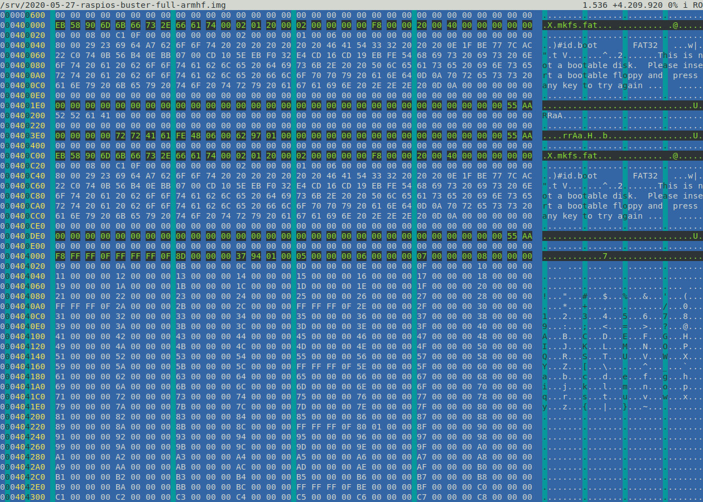
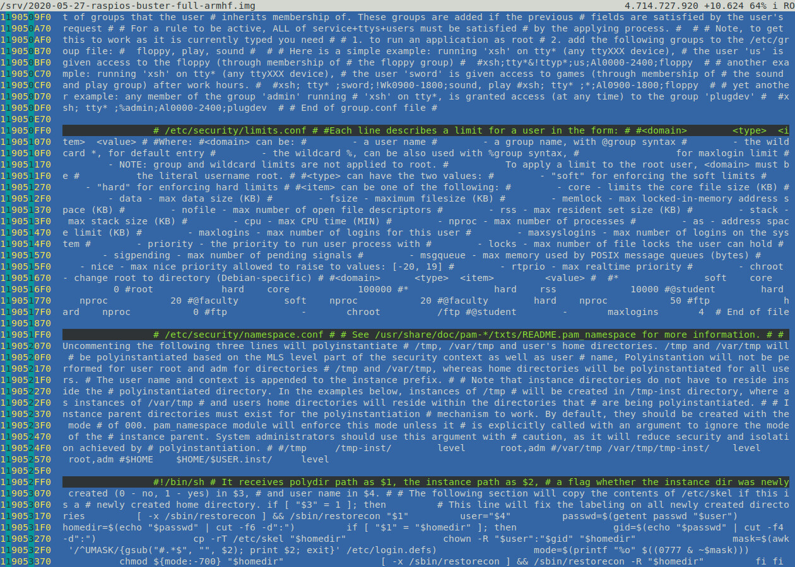
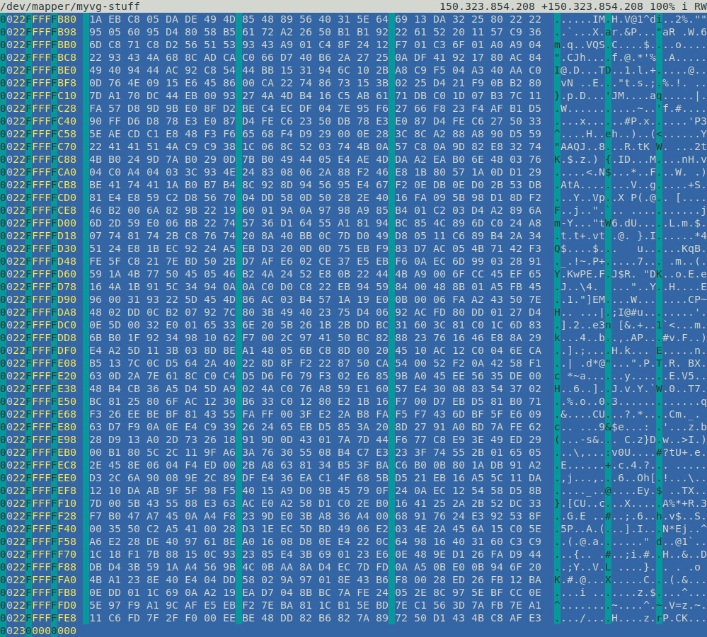
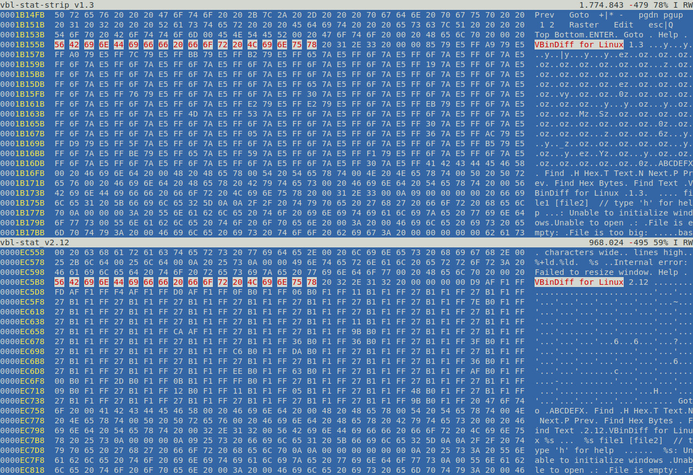
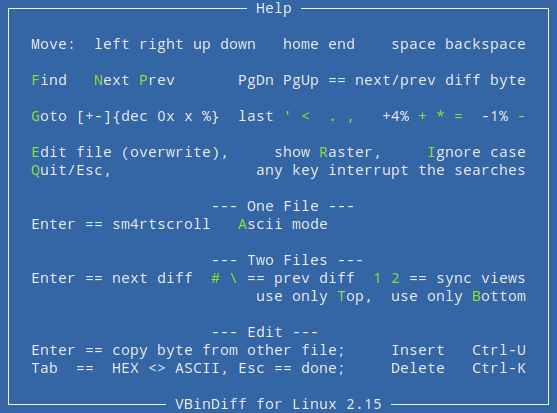

vbl - VBindiff for Linux
========================

Hex viewer and differ

For you Linuxer!

dynamic 16/24/32 byte Hex & ASCII view in a terminal

256TB Files

64-bit static + dynamic

based on "*VBinDiff - Visual Binary Diff*" by Christopher J. Madsen

Features:
---------

 - Ascii search `f`
 - Binary search
 - Forward search `n`
 - Backward search `p`
 - Case insensitive `i`
 - Search history `Up` `Dn`
 - Search edit `Ins` `Del` `^u` `^k`
 - Search highlight
 - Search indentation
 - Search interruption `ANY`
 - Visual feedback
 - Goto position decimal `g`
 - Goto position percent
 - Goto position hex (abcd 0x1234 1234x)
 - Goto position offset (+addr -addr)
 - Goto position history `Up` `Dn`
 - Goto last `'` `.`
 - Next difference `Enter` (two files)
 - Prev difference `#` `\` (two files)
 - Next different byte `PgDn`
 - Prev different byte `PgUp`
 - Sync 1. with 2. view `1` (two files)
 - Sync 2. with 1. view `2` (two files)
 - File position decimal
 - File position percent
 - File offset difference
 - _Smartscroll_ (single mode) `ENTER`
 - Skip forward 4% `+` `*` `=`
 - Skip backward 1% `-`
 - ASCII-Mode (single mode) `a`
 - Column raster `r`
 - Edit file (overwrite) `e`
 - RW/RO detection
 - Use only top file `t`
 - Use only bottom file `b`
 - Help window `h`
 - Quit `q` `Esc`

Build:
------

```
# headers + *meson* (debian)
apt install libncurses-dev meson

meson setup vbl && meson compile -C vbl
```

Test:
-----

```
./vbl/vbl
./vbl/vbl-strip
./vbl/vbl-stat
./vbl/vbl-stat-strip
```

Screenshoots:
-------------


*One File*


*ASCII Mode*


*Files >64GB*


*Two Files*


*Help Screen*
