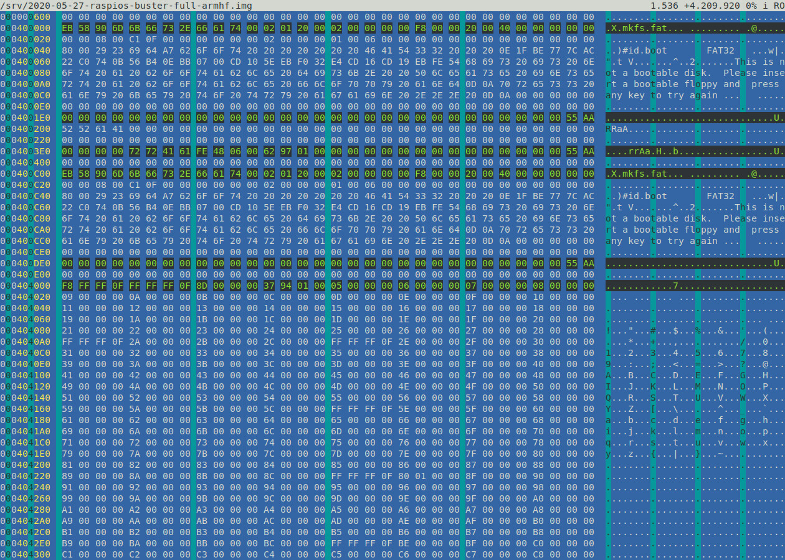
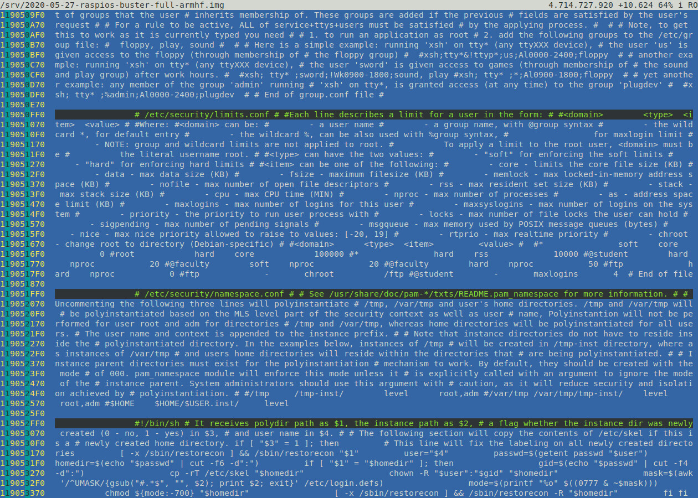
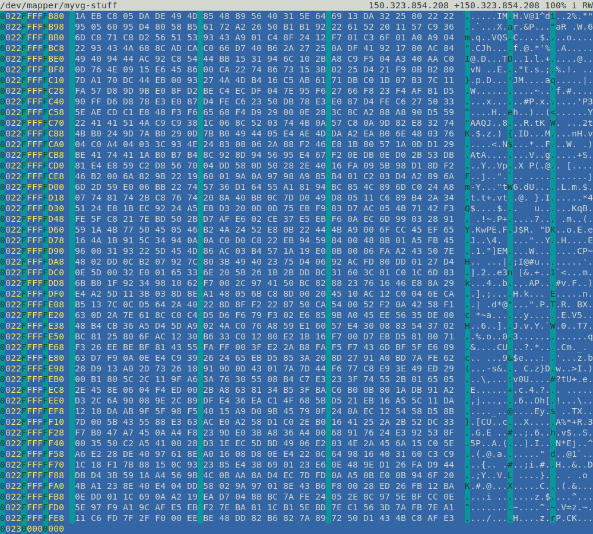
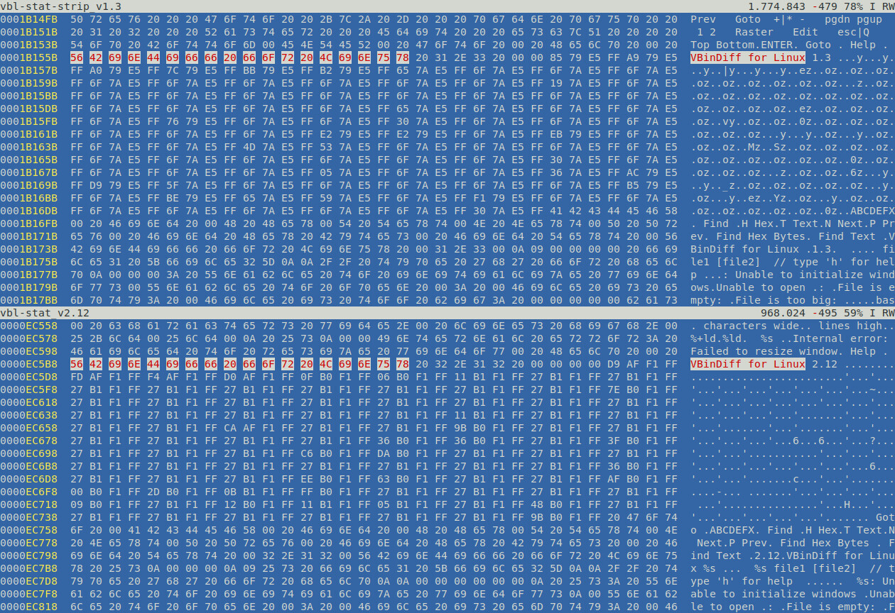
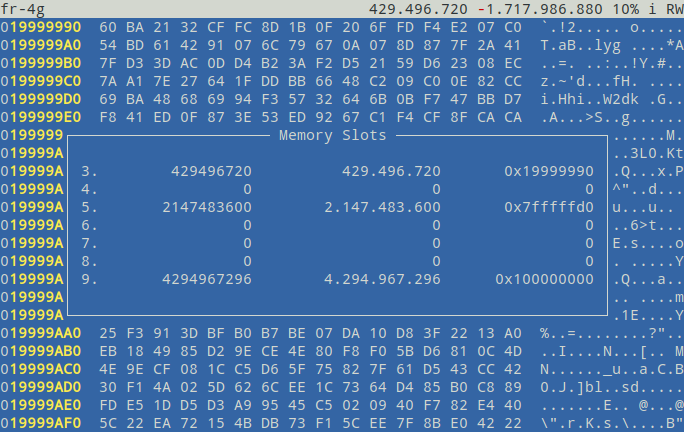
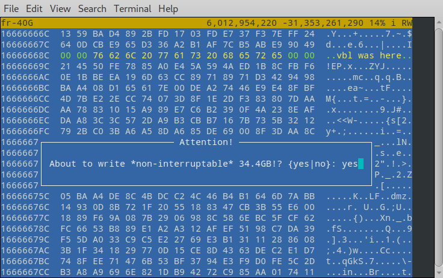
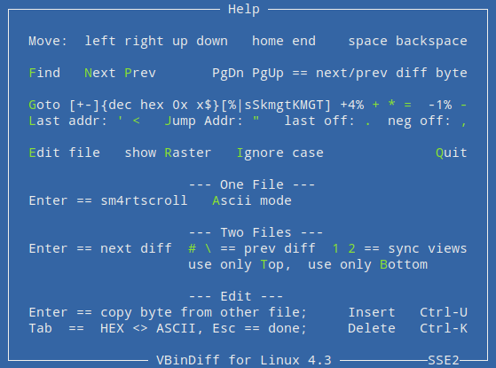

vbl - VBindiff for Linux
========================

Hex viewer, differ, dumper and editor

dynamic 16/24/32 byte Hex & ASCII view in a terminal

256TB Files & Devices

edit / insert / delete

zero-tolerant _TurboSearch_ for SSD

Smartscroll

memory slots

diff mode

dump mode

SIMD speedup

64-bit static + dynamic

asm + disasm code

Features:
---------

 - Ascii search `f`
 - Binary search
 - Forward search `n`
 - Backward search `p`
 - Case insensitive `i`
 - Search history `Up` `Dn`
 - Search edit `Ins` `Del` `^u` `^k`
 - Search highlight
 - Search indentation
 - Search interruption `Esc`
 - Visual feedback
 - Goto position decimal `g`
 - Goto position percent
 - Goto position hex (abcd 0x1234 1234x)
 - Goto position 2** (kmgt)
 - Goto position 10** (KMGT)
 - Goto position *512 (s)
 - Goto position *4096 (S)
 - Goto position offset (+addr -addr)
 - Goto position history `Up` `Dn`
 - Goto last address `'` `<`
 - Goto last offset `.`
 - Goto last offset neg `,`
 - Set  last address `l`
 - Set  jump address `j`
 - Get  jump address `"`
 - Set   memory slot `3` `4` `5` `6` `7` `8` `9`
 - Get   memory slot `3` `4` `5` `6` `7` `8` `9`
 - Reset memory slot `3` `4` `5` `6` `7` `8` `9`
 - Reset all memory slots `0`
 - Show  all memory slots `s`
 - Next difference `Enter`
 - Prev difference `#` `\`
 - Next different byte `PgDn`
 - Prev different byte `PgUp`
 - Sync 1. with 2. view `1`
 - Sync 2. with 1. view `2`
 - File position decimal
 - File position percent
 - File offset difference
 - _Smartscroll_ (single mode) `ENTER`
 - Skip forward 4% `+` `*` `=`
 - Skip backward 1% `-`
 - ASCII-Mode (single mode) `a`
 - Column raster `r`
 - Reload file `o`
 - Edit file `e`
 - Edit insert byte `Ins`
 - Edit delete byte `Del`
 - RW/RO detection
 - Use only top file `t`
 - Use only bottom file `b`
 - Help window `h`
 - Quit `q`
 - Easter egg

Notes:
------

All operations take place in read-only mode.

Only if you _exit_ the edit mode and there are changes and you _explicitly_ confirm this will the file be temporarily opened for read/write.

With inserted or deleted bytes, the write can be huge, so it happens always **in place**.

The _last address_ is auto set and can be get with `'` or `<`.

A _fixed_ jump address can be set with `j` and get with `"`; init with param.

A _single_ memory slot can be reset with _address 0_.

The starting point for _seek next diff byte_ is bottom-right.

The starting point for _seek prev diff byte_ is top-left; with added _Page Up_.

A pane offset difference _remains_ during comparison.

`Goto` position is now 2** kmgt and 10** KMGT(S.I.); with added _sector_ support.

`Esc` can interrupt the searches.

Only `q` quit the program.

Memory slots:
-------------

```
Key     Slot    Offset  Check               Last addr       Action
---     ----    ------  -----               ---------       ------
3-9     free    >0      addr not in slots                   set slot
3-9     used    >0                          set to offset   get slot
3-9     used     0      confirm reset       set to slot     set slot to 0
0       used            confirm reset all                   set all  to 0
s                                                           show all

['<]                                                        get last addr
```

Build:
------

```
# headers + *meson* (debian)
apt install libncurses-dev meson

meson setup vbl

### change thousands separator from dot/default to comma:
# meson configure -Dcpp_args="-DTHOU_SEP_COMMA=1" vbl

meson compile -C vbl
```

Exe:
----

```
./vbl/vbl               64-bit executable
./vbl/vbl-strip
./vbl/vbl-stat          static version
./vbl/vbl-stat-strip
```

Asm:
----

```
vbl/vbl_asm.lst:        cleaned assembly

vbl/vbl_asm-diff.lst:   more cleaned for diff/dwdiff

vbl/vbl_dis.lst:        disassembly with color codes
```

Screenshoots:
-------------

  
*One File*

  
*ASCII Mode*

  
*Files >64GB*

  
*Two Files*

  
*Memory Slots*

  
*You have to confirm long writes (>512MB)*

  
*Help Screen*

Cmdline:
--------

```
VBinDiff for Linux 4.6

	vbl file [file2] [addr] [addr2]                     // ncurses

	vbl file1 file2 -                                   // diff view

	vbl file1 file2 --                                  // diff exit

	vbl file -  [start [end]] [length{l$}] [width{w$}]  // dump ascii

	vbl file -- [start [end]] [length{l$}]              // dump binary

// type 'h' for help
```

Shortcut:
---------

```
vb () { [[ $2 ]] && vbl "$1" "$2" - || echo "vb file1 file2 [-]";}

```

