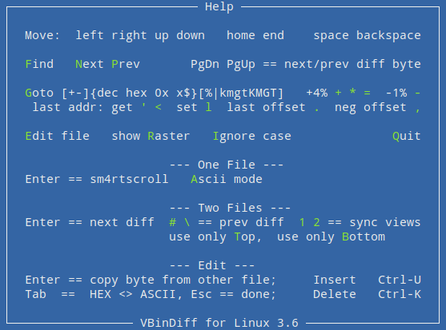

vbl - VBindiff for Linux
========================

Hex viewer, differ and editor

dynamic 16/24/32 byte Hex & ASCII view in a terminal

256TB Files

edit / insert / delete

64-bit static + dynamic

based on "*VBinDiff - Visual Binary Diff*" by Christopher J. Madsen

Features:
---------

 - Ascii search `f`
 - Binary search
 - Forward search `n`
 - Backward search `p`
 - Case insensitive `i`
 - Search history `Up` `Dn`
 - Search edit `Ins` `Del` `^u` `^k`
 - Search highlight
 - Search indentation
 - Search interruption `Esc`
 - Visual feedback
 - Goto position decimal `g`
 - Goto position percent
 - Goto position hex (abcd 0x1234 1234x)
 - Goto position 10** (kmgt)
 - Goto position 2** (KMGT)
 - Goto position offset (+addr -addr)
 - Goto position history `Up` `Dn`
 - Goto last address `'` `<`
 - Goto last offset `.`
 - Goto last offset neg `,`
 - Set  last address `l`
 - Set  last address auto `g` `f` `Home` `End`
 - Next difference `Enter`
 - Prev difference `#` `\`
 - Next different byte `PgDn`
 - Prev different byte `PgUp`
 - Sync 1. with 2. view `1`
 - Sync 2. with 1. view `2`
 - File position decimal
 - File position percent
 - File offset difference
 - _Smartscroll_ (single mode) `ENTER`
 - Skip forward 4% `+` `*` `=`
 - Skip backward 1% `-`
 - ASCII-Mode (single mode) `a`
 - Column raster `r`
 - Edit file `e`
 - Edit insert byte `Ins`
 - Edit delete byte `Del`
 - RW/RO detection
 - Use only top file `t`
 - Use only bottom file `b`
 - Help window `h`
 - Quit `q`
 - Easter egg

Notes:
------

All operations take place in read-only mode.

Only if you _exit_ the edit mode and there are changes and you _explicitly_ confirm this will the file be temporarily opened for read/write.

With inserted or deleted bytes, the write can be huge, so it happens always **in place**.

The _last address_ is auto set with initial `Find`, `Goto` w/o relative, `home`/`end` or manual with `l`.

New _TurboSearch_ for SSD: but avoid a leading null byte when searching in massive empty space!

Only `Esc` interrupt the searches.

Only `q` quit the program.

Build:
------

```
# headers + *meson* (debian)
apt install libncurses-dev meson

meson setup vbl && meson compile -C vbl
```

Test:
-----

```
./vbl/vbl
./vbl/vbl-strip
./vbl/vbl-stat
./vbl/vbl-stat-strip
```

Screenshoots:
-------------

  
*One File*

  
*ASCII Mode*

  
*Files >64GB*

  
*Two Files*

  
*You have to confirm long writes (>512MB)*

  
*Help Screen*

